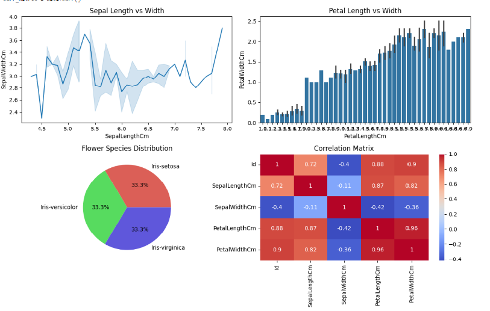

# Data Analysis Dashboard

This project demonstrates the development of a data analysis dashboard using Python libraries such as Pandas, NumPy, Matplotlib, and Seaborn. The dashboard provides various visualizations to analyze and understand the data effectively.

# Dashboard Final Output 

The final output of the python dashboard using pandas,numpy,matplotlib and seaborn has been displayed below ,

# Features

* Line chart of sepal length vs sepal width
* Bar chart of petal length vs petal width
* Pie chart of flower species distribution
* Correlation matrix

# Prerequisites

* Python 3.6 or higher
* Pandas
* NumPy
* Matplotlib
* Seaborn

# Installation

1. Clone the repository:

                     git clone https://github.com/your-username/data-analysis-dashboard.git

3. Install the required libraries:

                     pip install pandas numpy matplotlib seaborn

# Usage

1. Load the data:
   python data = pd.read_csv("your_data.csv")

2. Run the script:
   python py_dashboard.py

3. The dashboard will be displayed .

# Tech Stack

**Language** - Python 3.10

# Share with the community

If you find this project interesting or helpful, don't hesitate to share with your community! Let's learn and grow together! 

# Conclusion 

In this project, we’ve developed a data analysis dashboard using Python libraries such as Pandas, NumPy, Matplotlib, and Seaborn. The model, a beacon of performance, awaits those go into the beautiful world of Python.
